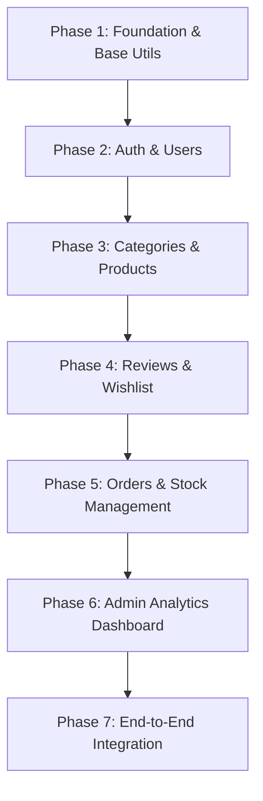

# Fabric Hub Backend Development Roadmap & Architecture

This document outlines the detailed development roadmap and architectural design for the Node.js/Express/MongoDB backend of **Fabric Hub**. The backend is designed using the Model-View-Controller (MVC) pattern and will serve as the production-ready API for the existing React frontend.

---

## 1. Folder Structure

The backend codebase will be structured using standard MVC guidelines for Node.js/Express applications to ensure high maintainability, separation of concerns, and clean routing:

```
Backend/
├── config/             # Configuration modules
│   └── db.js           # Database connection setup
├── controllers/        # Request handlers (Business logic layer)
│   ├── authController.js
│   ├── categoryController.js
│   ├── productController.js
│   ├── orderController.js
│   ├── reviewController.js
│   └── wishlistController.js
├── middlewares/        # Custom Express middlewares
│   ├── auth.js         # JWT protection & role-based authorization
│   ├── errorHandler.js # Centralized global error handling
│   └── validate.js     # Payload validation middleware
├── models/             # Mongoose schemas & DB models (Data layer)
│   ├── User.js
│   ├── Product.js
│   ├── Category.js
│   ├── Order.js
│   ├── Review.js
│   └── Wishlist.js
├── routes/             # API routing (Presentation layer)
│   ├── authRoutes.js
│   ├── categoryRoutes.js
│   ├── productRoutes.js
│   ├── orderRoutes.js
│   ├── reviewRoutes.js
│   └── wishlistRoutes.js
├── utils/              # Shared helper functions and error utilities
│   ├── AppError.js     # Custom Operational Error class
│   ├── catchAsync.js   # Wraps async routes to eliminate try-catch boilerplate
│   └── generateToken.js# JWT token generator helper
├── uploads/            # Local storage folder for product/category images
├── server.js           # Entry point (initializes Express, connects DB, starts listener)
├── package.json        # Dependencies and startup scripts
└── .env                # Sensitive environment variables (ignored in Git)
```

---

## 2. Responsibilities of Each Folder

*   **`config/`**: Manages environment integrations (like MongoDB connection logic). Keeps global initialization settings separated from standard application flow.
*   **`controllers/`**: The core logic container. Extracts request parameters, interacts with database models, runs calculations/business logic, and returns formatted JSON API responses.
*   **`middlewares/`**: Code that runs in the request-response cycle before reaching the final controller. Handles cross-cutting logic like parsing authentication tokens, restricting endpoints by user roles, validation, and handling uncaught exceptions.
*   **`models/`**: Defines schemas, data types, indexes, and custom validation constraints for MongoDB collections. Incorporates hooks (pre-save, post-save) to run logic (e.g., password hashing) directly on DB interactions.
*   **`routes/`**: Acts as a dispatcher routing specific request methods and URLs to their corresponding controller functions, applying route-specific middlewares (like authentication) as needed.
*   **`utils/`**: Reusable code snippets and classes. Contains helper scripts for things like email delivery, math operations, token generation, or custom error classification.
*   **`uploads/`**: Stores static assets uploaded dynamically (e.g., category pictures, product images) before returning public file paths.

---

## 3. Development Order (Roadmap)

To ensure high-velocity delivery with robust test coverage, backend development will follow a linear dependency chain:



### Phase 1: Foundation & Base Utilities
1. Define package dependencies (`express`, `mongoose`, `cors`, `dotenv`, `bcryptjs`, `jsonwebtoken`, `helmet`, `express-rate-limit`, `joi`, etc.).
2. Set up base variables in `.env` (Port, JWT Secret, Token Expiry).
3. Connect the application to MongoDB.
4. Establish the centralized global error handler middleware and the custom `AppError` class.

### Phase 2: Authentication & User Management
1. Build `User` model containing registration schemas, indexes, and automatic bcrypt hashing logic.
2. Develop authentication controllers (`register`, `login`, `getMe`).
3. Set up authentication utility middleware:
    *   `protect`: Intercepts and validates JWT from Authorization header.
    *   `restrictTo('admin')`: Restricts path access to admin role.

### Phase 3: Categories & Products
1. Define the `Category` model. Establish admin CRUD endpoints and user list/details routes.
2. Define the `Product` model containing links to categories, specifications, image paths, and stock levels.
3. Build advanced product retrieval queries supporting searching, sorting, pagination, and filters (size, color, category, price ranges).
4. Implement admin-restricted CRUD APIs for inventory management.

### Phase 4: Reviews & Wishlist
1. Build `Review` schema linked to both a user and a product.
2. Setup review creation with restriction logic (e.g., limit reviews to users who bought the item or limit to one review per product).
3. Build Mongoose pre/post hooks to automatically recalculate average product `rating` and `reviewsCount` when reviews are created/deleted.
4. Build the `Wishlist` schema mapping users to products. Provide toggle options (add/remove).

### Phase 5: Orders & Stock Management
1. Build the `Order` model representing customer details, items, unit prices, total amount, and delivery status.
2. Set up order creation endpoints (User-only). Ensure transaction safety:
    *   Validate product stock.
    *   Deduct inventory stock levels dynamically on success.
3. Setup user orders history retrieval.
4. Build admin endpoints to manage order workflows (processing, shipping, delivery, cancellations).

### Phase 6: Admin Analytics Dashboard
1. Implement aggregation queries inside `adminController.js` reporting:
    *   Total Sales (excluding cancelled orders).
    *   Count of pending vs delivered orders.
    *   Low stock alerts (products with stock < 5).
    *   Category sales breakdown.

### Phase 7: End-to-End Integration
1. Validate all routes through automated API testing (Postman collections/Supertest).
2. Hook up the backend to the React frontend by replacing mockup contexts (`AuthContext`, `CartContext`) with `fetch`/`axios` HTTP requests.

---

## 4. Database Collections & Schema Design

Here is the database schema mapping for MongoDB. It is aligned with the fields used by the React components in the frontend code.

### 4.1. Users Collection (`users`)
Stores profiles and determines authorizations.
```javascript
{
  _id: ObjectId,
  name: { type: String, required: true },
  email: { type: String, required: true, unique: true, lowercase: true, index: true },
  password: { type: String, required: true, select: false }, // Hidden by default in queries
  role: { type: String, enum: ['user', 'admin'], default: 'user' },
  createdAt: Date,
  updatedAt: Date
}
```

### 4.2. Categories Collection (`categories`)
Groups products dynamically.
```javascript
{
  _id: ObjectId,
  name: { type: String, required: true, unique: true },
  slug: { type: String, required: true, unique: true, index: true },
  image: { type: String, required: true }, // URL or path
  description: { type: String },
  createdAt: Date,
  updatedAt: Date
}
```

### 4.3. Products Collection (`products`)
Stores Fabric items and attributes.
```javascript
{
  _id: ObjectId,
  name: { type: String, required: true },
  slug: { type: String, required: true, unique: true, index: true },
  price: { type: Number, required: true },
  category: { type: Schema.Types.ObjectId, ref: 'Category', required: true, index: true },
  image: { type: String, required: true }, // Main cover image
  images: [{ type: String }], // Detail gallery images
  description: { type: String, required: true },
  rating: { type: Number, default: 0 },
  reviewsCount: { type: Number, default: 0 },
  stock: { type: Number, required: true, min: 0 },
  inStock: { type: Boolean, default: true },
  sizes: [{ type: String }], // e.g. ["XS", "S", "M", "L", "XL", "OS"]
  colors: [{
    name: { type: String },  // e.g. "Ivory"
    value: { type: String }  // e.g. "#FFFFF0"
  }],
  isFeatured: { type: Boolean, default: false },
  isBestSeller: { type: Boolean, default: false },
  details: [{ type: String }], // Specifications (e.g. ["100% fine materials", "Dry clean only"])
  createdAt: Date,
  updatedAt: Date
}
```

### 4.4. Orders Collection (`orders`)
Records purchase details.
```javascript
{
  _id: ObjectId,
  orderId: { type: String, required: true, unique: true }, // e.g., FH534298
  user: { type: Schema.Types.ObjectId, ref: 'User', required: true, index: true },
  customerName: { type: String, required: true },
  customerEmail: { type: String, required: true },
  shippingDetails: {
    address: { type: String, required: true },
    city: { type: String, required: true },
    postal: { type: String, required: true }
  },
  items: [{
    product: { type: Schema.Types.ObjectId, ref: 'Product', required: true },
    quantity: { type: Number, required: true, min: 1 },
    price: { type: Number, required: true }, // Snapshotted price at order time
    size: { type: String },
    color: { type: String }
  }],
  totalAmount: { type: Number, required: true },
  status: { type: String, enum: ['Pending', 'Processing', 'Shipped', 'Delivered', 'Cancelled'], default: 'Pending', index: true },
  createdAt: Date,
  updatedAt: Date
}
```

### 4.5. Reviews Collection (`reviews`)
Customer ratings and reviews.
```javascript
{
  _id: ObjectId,
  user: { type: Schema.Types.ObjectId, ref: 'User', required: true },
  product: { type: Schema.Types.ObjectId, ref: 'Product', required: true, index: true },
  rating: { type: Number, required: true, min: 1, max: 5 },
  comment: { type: String, required: true },
  createdAt: Date,
  updatedAt: Date
}
```

### 4.6. Wishlists Collection (`wishlists`)
Saves liked items for users.
```javascript
{
  _id: ObjectId,
  user: { type: Schema.Types.ObjectId, ref: 'User', required: true, unique: true, index: true },
  products: [{ type: Schema.Types.ObjectId, ref: 'Product' }],
  updatedAt: Date
}
```

---

## 5. Relationships Between Collections

*   **User ↔ Orders (1-to-Many)**: A single `User` makes multiple `Orders`. The link is made through the `user` reference attribute inside the `Order` model.
*   **Category ↔ Products (1-to-Many)**: A category contains many products. The relationship is set using a reference (`category`) in the `Product` model.
*   **Product ↔ Reviews (1-to-Many)**: A product gets rated and reviewed by many customers. Stored using references (`product` and `user` keys in `Review`).
*   **User ↔ Wishlist (1-to-1)**: Every user gets a single, distinct list. It contains a `user` ObjectId link and an array of `products` ObjectIds.
*   **Order ↔ Products (Many-to-Many)**: Many products belong in many orders. Stored as an array of items inside each `Order` document, with snapshots of the exact unit prices, colors, and sizes at order-placement time to protect record history from future product modifications.

---

## 6. REST API Architecture (Endpoints)

All APIs prefix: `/api/v1`

### 6.1. Authentication Routes (`/auth`)
| Method | Endpoint | Description | Access |
| :--- | :--- | :--- | :--- |
| `POST` | `/register` | Sign up a new user & return JWT token | Public |
| `POST` | `/login` | Log in user, verify credentials & return JWT | Public |
| `GET` | `/me` | Retrieve the logged-in user's profile | User/Admin (Protected) |

### 6.2. Category Routes (`/categories`)
| Method | Endpoint | Description | Access |
| :--- | :--- | :--- | :--- |
| `GET` | `/` | List all product categories | Public |
| `GET` | `/:slug` | Get single category by its slug | Public |
| `POST` | `/` | Create a new category | Admin |
| `PUT` | `/:id` | Update category details/image | Admin |
| `DELETE`| `/:id` | Delete a category | Admin |

### 6.3. Product Routes (`/products`)
| Method | Endpoint | Description | Access |
| :--- | :--- | :--- | :--- |
| `GET` | `/` | Retrieve products (Supports filters, search, sort, pagination) | Public |
| `GET` | `/:id` | Get details of a single product | Public |
| `POST` | `/` | Add a new product to inventory | Admin |
| `PUT` | `/:id` | Modify product attributes / update stock | Admin |
| `DELETE`| `/:id` | Delete a product from inventory | Admin |

### 6.4. Order Routes (`/orders`)
| Method | Endpoint | Description | Access |
| :--- | :--- | :--- | :--- |
| `POST` | `/` | Create a new order, deduct product stock levels | User (Protected) |
| `GET` | `/my-orders`| Retrieve orders placed by the current user | User (Protected) |
| `GET` | `/` | List all orders across the platform | Admin |
| `PUT` | `/:id/status`| Update status (e.g., Processing ➔ Shipped ➔ Delivered) | Admin |

### 6.5. Review Routes (`/reviews`)
| Method | Endpoint | Description | Access |
| :--- | :--- | :--- | :--- |
| `POST` | `/` | Add a rating & comment for a product | User (Protected) |
| `GET` | `/product/:productId` | Retrieve all user reviews for a specific product | Public |

### 6.6. Wishlist Routes (`/wishlist`)
| Method | Endpoint | Description | Access |
| :--- | :--- | :--- | :--- |
| `GET` | `/` | Retrieve all items added to the user's wishlist | User (Protected) |
| `POST` | `/toggle` | Add/Remove product ID from user's wishlist array | User (Protected) |

### 6.7. Admin Dashboard Routes (`/admin`)
| Method | Endpoint | Description | Access |
| :--- | :--- | :--- | :--- |
| `GET` | `/dashboard-stats` | Aggregated report of total sales, status counts, stock levels | Admin |

---

## 7. Security Practices

The application will incorporate industry-grade security packages and code designs:

1.  **Sensitive Data Hashing**: Passwords will be cryptographically hashed with `bcryptjs` using a salt work factor of `12` before committing to the database. The password field will be set to `select: false` in Mongoose to prevent accidental leaks in raw queries.
2.  **Stateless JWT Security**: Protected pages require standard authentication headers: `Authorization: Bearer <JWT_TOKEN>`. Tokens will be signed with `HS256`, utilizing a secure secret and an expiration policy (e.g., 7 days).
3.  **Role-Based Security**: Explicit admin verification middlewares:
    ```javascript
    exports.restrictTo = (...roles) => {
      return (req, res, next) => {
        if (!roles.includes(req.user.role)) {
          return next(new AppError('Unauthorized access.', 403));
        }
        next();
      };
    };
    ```
4.  **NoSQL Injection Defense**: Use of `express-mongo-sanitize` to strip special characters (like `$` and `.`) from user input before query parsing.
5.  **Brute-Force & Rate Limiting**: Application of `express-rate-limit` on security-sensitive routes (`/auth/login` and `/auth/register`) to restrict users to a maximum of 100 requests per 15 minutes.
6.  **Secure HTTP Headers**: Use of `helmet` middleware to set secure HTTP headers (e.g., disabling `X-Powered-By`).
7.  **Cross-Origin Request Filtering (CORS)**: Restrict requests to trusted frontend origins.

---

## 8. Error Handling Strategy

To prevent Express crash loops and guarantee clean, user-friendly client feedback:

1.  **Custom AppError Class**:
    An operational error class extending native `Error` to easily return custom HTTP statuses:
    ```javascript
    class AppError extends Error {
      constructor(message, statusCode) {
        super(message);
        this.statusCode = statusCode;
        this.status = `${statusCode}`.startsWith('4') ? 'fail' : 'error';
        this.isOperational = true; // Signals that it's a handled client error

        Error.captureStackTrace(this, this.constructor);
      }
    }
    ```
2.  **Eliminating try-catch Clutter**:
    An async utility wrapper to handle promise rejections and forward them directly to the Express error boundary:
    ```javascript
    const catchAsync = fn => {
      return (req, res, next) => {
        fn(req, res, next).catch(next);
      };
    };
    ```
3.  **Centralized Error Interceptor Middleware**:
    A single error listener that shapes error responses based on execution environments:
    *   **Development**: Returns stack traces, raw error properties, and status descriptions.
    *   **Production**: Returns clear, customized user alerts for MongoDB specific validation issues (e.g., CastError, DuplicateKeyError code 11000, and Mongoose ValidationError) while hiding code details.

---

## 9. Validation Strategy

We will validate all incoming client inputs before execution to protect database integrity:

1.  **Validation Library**: Use of **`Joi`** schemas to define validation structures.
2.  **Automated Schema Checkers**:
    A generic request validation middleware applied at the router level:
    ```javascript
    const validateRequest = (schema) => {
      return (req, res, next) => {
        const { error } = schema.validate(req.body, { abortEarly: false, allowUnknown: true });
        if (error) {
          const errors = error.details.map(detail => detail.message);
          return next(new AppError(errors.join(', '), 400));
        }
        next();
      };
    };
    ```
3.  **Schema Enforcements**:
    *   **Authentication**: Validate emails match typical structural regex. Enforce password minimum lengths (e.g., 6 characters).
    *   **Products**: Ensure numeric inputs (prices, inventory stock counts) are strictly greater than or equal to zero. Enforce correct hex string formats for colors.
    *   **Orders**: Enforce structure in items lists (ensure at least 1 item is requested, check quantity boundaries, and check valid sizes/colors matches). Validate shipping details (city, zip, and address strings are present).

